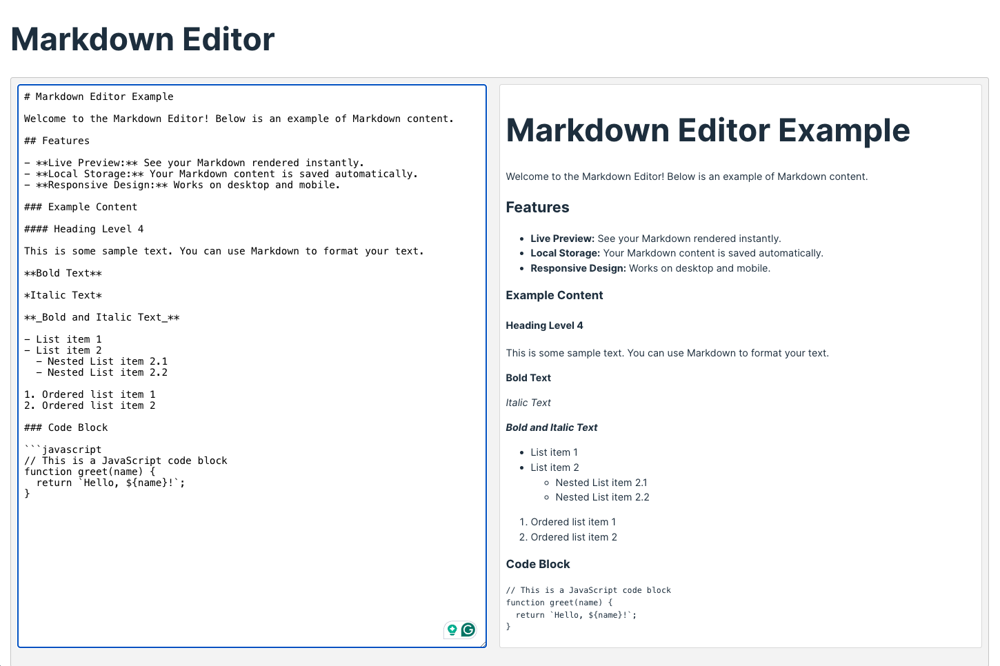

# Markdown Editor

A simple Markdown editor built with React and Vite. This project allows users to write Markdown text, see live previews, and persist their notes using local storage.




## Features

- Write Markdown text in a text area.
- Live preview of Markdown content.
- Save and load Markdown content using local storage.

## Getting Started

### Prerequisites

Make sure you have the following installed:

- Node.js (v14 or later)
- npm or Yarn

### Installation

1. **Clone the repository:**

   ```bash
   git clone https://github.com/luismendes535/simple-markdown-editor.git

   ```

2. **Navigate to the project directory:**

   ```bash
   cd simple-markdown-editor

   ```

3. **Install dependencies:**

   ```bash
    npm install
    # or
    yarn install

   ```

4. **Start the development server:**

   ```bash
   npm run dev
   # or
   yarn dev

   ```

